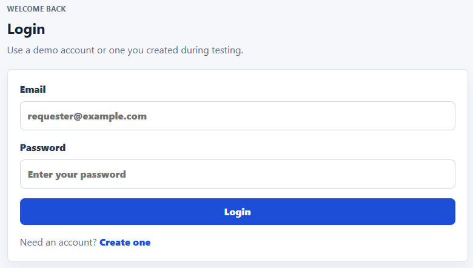
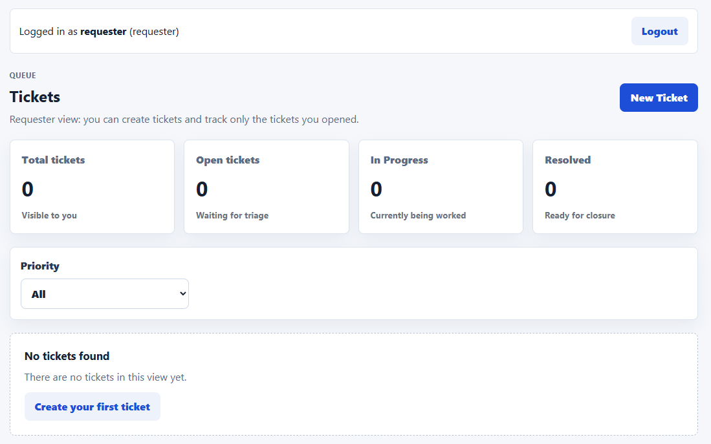
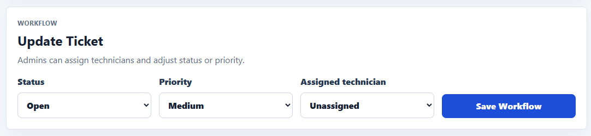
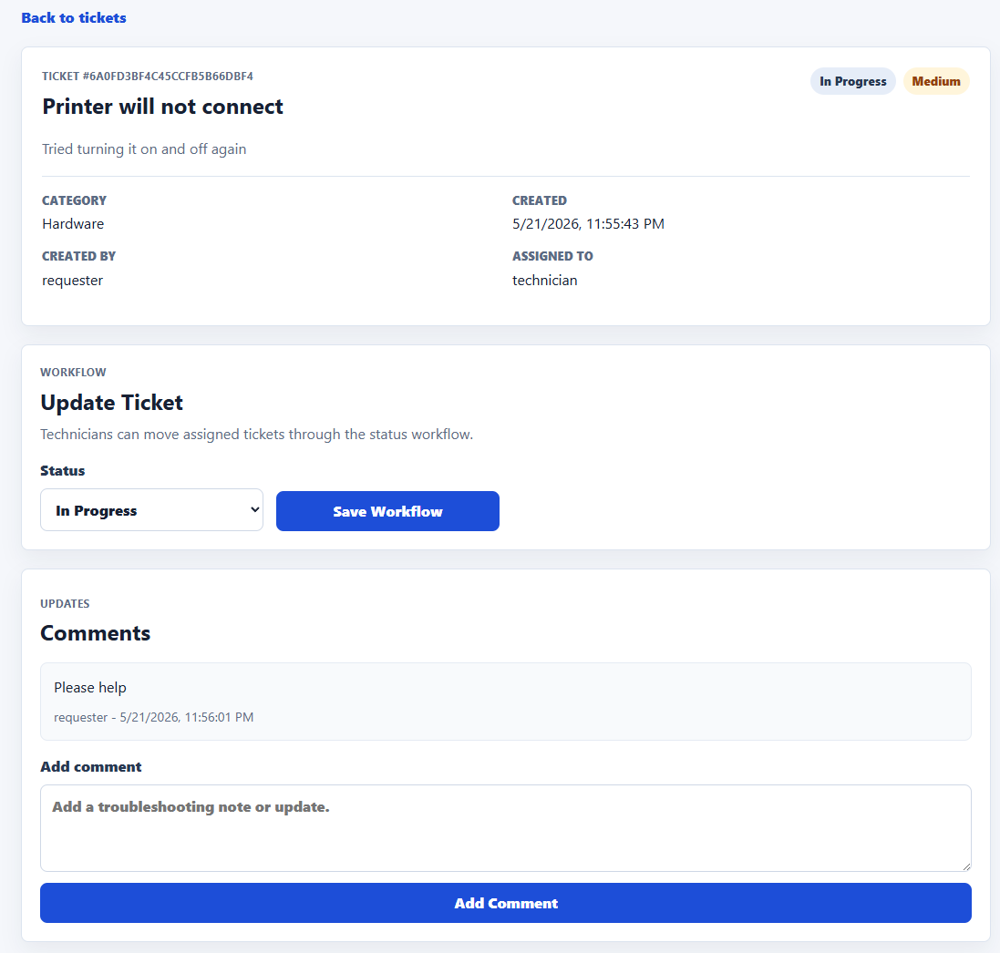
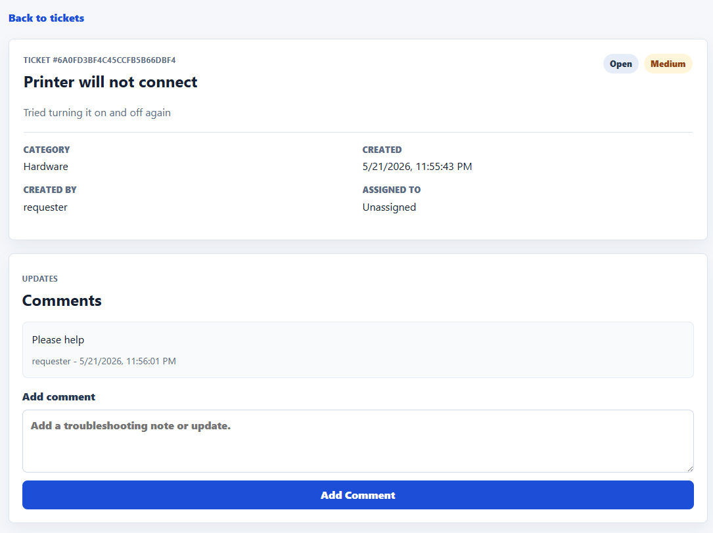

# IT Help Desk Ticket Tracker

A full-stack IT help desk ticket tracker built for internship and entry-level IT/job applications. The app models a realistic support workflow where requesters submit issues, technicians work assigned tickets, and admins manage the queue.

## Project Overview

This project demonstrates a practical internal support tool instead of a generic CRUD app. It includes authentication, role-based ticket visibility, MongoDB persistence, ticket comments, assignment workflow, status updates, priority filtering, and a clean React interface.

## Why I Built This

I built this project to show that I can connect software development skills to real IT support workflows. Help desk teams need clear intake, ownership, prioritization, and status tracking, so this app gave me a focused way to practice full-stack development while building something relevant to IT internships and junior technical roles.

## Features

- Signup, login, and logout
- Password hashing with `bcryptjs`
- JWT authentication stored in `localStorage`
- Role-based users:
  - `requester`
  - `technician`
  - `admin`
- Requesters can create tickets and view their own tickets
- Technicians can view assigned tickets and update status
- Admins can view all tickets, assign technicians, and update status/priority
- MongoDB-backed tickets and comments
- Ticket statuses:
  - Open
  - In Progress
  - Resolved
  - Closed
- Ticket priorities:
  - Low
  - Medium
  - High
  - Critical
- Priority filtering
- Dashboard cards for visible tickets
- Comments on ticket detail pages
- Responsive, portfolio-friendly UI

## Tech Stack

- React
- Vite
- React Router
- Node.js
- Express
- MongoDB Atlas
- Mongoose
- bcryptjs
- JSON Web Tokens
- CSS

## Screenshots

### Login



### Requester Dashboard



### Admin Assignment



### Technician Workflow



### Ticket Detail



## Folder Structure

```txt
client/
  index.html
  package.json
  vite.config.js
  src/
    api/
    components/
    context/
    pages/
    styles/
server/
  config/
  middleware/
  models/
  routes/
  utils/
```

## Environment Variables

Create `server/.env`:

```env
PORT=9000
MONGO_URI=your_mongodb_connection_string
JWT_SECRET=replace_this_with_a_long_random_secret
CORS_ORIGIN=http://127.0.0.1:5173,http://localhost:5173
```

Optional frontend override in `client/.env`:

```env
VITE_API_BASE_URL=http://localhost:9000/api
```

Do not commit `.env` files. This project ignores `.env` in `.gitignore`.

### Production Environment Variables

Backend production variables:

```txt
MONGO_URI=your_mongodb_atlas_production_connection_string
JWT_SECRET=a_long_random_production_secret
CORS_ORIGIN=https://your-vercel-app.vercel.app
```

Frontend production variables:

```txt
VITE_API_BASE_URL=https://your-render-backend.onrender.com/api
```

Notes:

- `JWT_SECRET` must be different from local/demo values.
- `MONGO_URI` should point to the production MongoDB Atlas database.
- `CORS_ORIGIN` should match the deployed frontend URL exactly.
- If you use Vercel preview deployments, add each allowed preview URL to `CORS_ORIGIN` separated by commas.

## Setup Instructions

Install backend dependencies:

```bash
cd server
npm install
```

On Windows PowerShell, use:

```bash
npm.cmd install
```

Start the backend:

```bash
npm run dev
```

On Windows PowerShell:

```bash
npm.cmd run dev
```

Install frontend dependencies in a second terminal:

```bash
cd client
npm install
```

On Windows PowerShell:

```bash
npm.cmd install
```

Start the frontend:

```bash
npm run dev
```

On Windows PowerShell:

```bash
npm.cmd run dev
```

Open:

```txt
http://127.0.0.1:5173
```

## Deployment Notes

This project is prepared for deployment, but it is not deployed automatically.

### Render Backend

Recommended Render settings:

```txt
Service type: Web Service
Root directory: server
Build command: npm install
Start command: npm start
```

Set these environment variables in Render:

```txt
MONGO_URI=your_mongodb_atlas_connection_string
JWT_SECRET=a_long_random_production_secret
CORS_ORIGIN=https://your-vercel-app.vercel.app
```

Render provides a `PORT` value for web services, so the backend reads `process.env.PORT` automatically.

After the backend deploys, copy the Render service URL. The frontend needs the API URL with `/api` at the end:

```txt
https://your-render-backend.onrender.com/api
```

### Vercel Frontend

Recommended Vercel settings:

```txt
Framework preset: Vite
Root directory: client
Build command: npm run build
Output directory: dist
```

Set this environment variable in Vercel:

```txt
VITE_API_BASE_URL=https://your-render-backend.onrender.com/api
```

Vite only exposes frontend environment variables that start with `VITE_`, so do not put backend secrets in frontend variables.

After Vercel deploys, copy the frontend URL and add it to the backend `CORS_ORIGIN` value in Render.

Official docs:

- [Render Express deployment](https://render.com/docs/deploy-node-express-app)
- [Render environment variables](https://render.com/docs/environment-variables)
- [Vercel Vite deployment](https://vercel.com/docs/frameworks/frontend/vite)
- [Vercel environment variables](https://vercel.com/docs/environment-variables)

## Demo Account Instructions

Create local demo users and sample tickets with:

```bash
cd server
npm run seed
```

On Windows PowerShell:

```bash
npm.cmd run seed
```

The seed script does not run automatically. It only runs when you manually call `npm run seed`.

Local/demo-only accounts:

```txt
Requester
Email: requester@example.com
Password: Password123!
Role: requester

Technician
Email: technician@example.com
Password: Password123!
Role: technician

Admin
Email: admin@example.com
Password: Password123!
Role: admin
```

The password `Password123!` is for local demo use only. Do not reuse it for real accounts or production deployments.

The seed script hashes demo passwords with `bcryptjs`, upserts the demo users, removes old demo tickets for those demo users, and recreates a small sample ticket queue.

## Testing The Role Workflow

1. Login as the requester.
2. Create a ticket.
3. Confirm the requester dashboard shows the ticket.
4. Logout and login as the technician.
5. Confirm the technician does not see the ticket yet.
6. Logout and login as the admin.
7. Open the ticket and assign it to the technician.
8. Optionally change the priority or status as admin.
9. Logout and login as the technician.
10. Confirm the assigned ticket appears.
11. Update the ticket status.
12. Logout and login as the requester.
13. Confirm the requester can still track their ticket status.

## API Routes

Auth:

```txt
POST /api/auth/signup
POST /api/auth/login
GET  /api/auth/me
GET  /api/auth/technicians
```

Tickets:

```txt
GET    /api/tickets
POST   /api/tickets
GET    /api/tickets/:id
PUT    /api/tickets/:id
DELETE /api/tickets/:id
POST   /api/tickets/:id/comments
PATCH  /api/tickets/:id/assign
```

## Future Improvements

- Better role permissions for closing or reopening tickets
- Search by title or description
- Pagination for large ticket queues
- File attachments
- Email notifications
- Admin user management page
- Deployment to Render/Vercel
- Automated tests with Jest, Supertest, or Playwright
